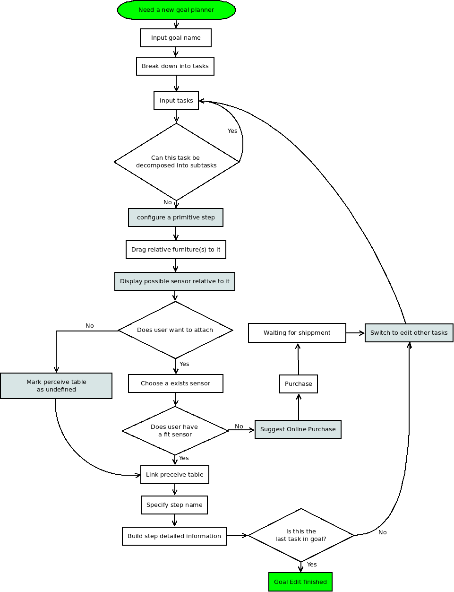

## Caregiver User Interface Documentation ##

- &#xf040; By Dan Wang, Jun 5, 2016. 
- &#xf062; Updated by Aaron Li, Jun 8, 2016, Add more details.

-------------

### [&#xf192;] **Targets and Requirements**

Caregiver component belongs to the second part of the system, the UI of "Planning" phase (see [Implementation structure](../proposal.md#-implementation-structure)). 

The "caregiver user interface" module is an interactive interface for caregivers to set up the domain knowledge for the intelligent assistance agent. The operations on this interface should be and not limit to:

 - **Create** new goals
 - **Modify** an existing tasks
 - **Specify** sensor for furniture

The details will be added into the following paragraphs.

### [&#xf0a1;] **UI Explanation**

Based on needs, the caregiver plan to add the task network of a new goal to the system, in order to expand the recognition capacity of the intelligent system, based on the domain knowledge that already been stored in last phase ([design control](../design_control/README.md)).
In this phase, the caregiver should go through the following steps.

#### Create A New Goal

 - Click on "add new goal"
 - Input goal name
	 - Goal name will be used for display and tracking propose

#### Modify An Existing Tasks

- Configure the **task network** of the goal according to following user interface prompts 
 - Step 1: For each task in the network, ask the user "**Can this task decompose into subtasks?**"
 - Step 2: If yes, ask the user to input all the subtasks and specify the **order relations** (for details please refer to "order relations of sub-tasks" section) of the sub-tasks. 
 - Repeat Step 1 and Step 2 until the user specified the complete task network for the goal. 
	 - A complete task network is a network that all goals are reduced to "primitive steps". Explanation as following.
- Machine help caregiver to configure a **primitive step**. 
	- A "primitive step" means this step **only relative to exactly one associated action**. 
	- A "primitive step" is a **leaf node** on the Hierarchical Task Network (HTN). Represent a state that the **system has the ability to determine if it finished**.
	- To demonstrate what is a primitive step in details, look at the following examples:
		- Example 1: turn on the light
			- This is a primitive step, since it consists of only one action:
				- Turn on
		- Example 2: Fill 1/3 of the tea kettle with water
			- This is a primitive step, since it consists of only one action:
				- Fill
		- Example 3: boil the tea
			- This is **not** a primitive step, since it does not consists of exactly one action, and it should be decomposed further by caregiver. Instead, it possibly consists of the followings:
				- Put the filled tea kettle on stove
				- turn on the stove
				- wait until noise made

#### Specify Sensor For Furniture

 - Step 1: Prompt user with "Please drag the related furniture(s) of this step to the operating window"
	 - In this step program will intend to 
 - Step 2: For each objects in the window:
	 - Identify the furniture category of the object based on the **furniture** table in HSE DB
	 - Identify associated sensors for the object by searching on the **sensor** table in HSE DB
		 - If the user already has the sensor, ask the user register the sensor on the system (this information will be stored into the **Perceive table** in HSE DB) and attach the sensor to the above-mentioned object. 
		 - If the user do not have the sensor yet, suggest the online purchase choices for the user. If the user confirm, the order will be made automatically by the system. At the same time, in **Perceive table** table, this furniture is recorded as "no attached sensor".
	 - Ask the user to specify the **Step Name**  by looking into the popped steps selection lists associated with this sensor, and select one of the step name.  When a step name is select, its preconditions and effects are also specified by searching on the **step precondition effects** table.

> **Extra Info: ** [&#xf05a;]
> Order Relations of Subtasks
> 
> An hierarchical task network indicates how a composite task can be decomposed into simpler subtasks. The sub-tasks of a composite task can have the following relations: 
> 
> - **Alternative subtasks**: the composite tasks have multiple ways to decompose, which way to choose depends on the current environment states.
> - **Ordered subtasks**: the sub-tasks must be implemented in order.
> - **Unordered subtasks**: the implementation order of sub-tasks does not matter.
> - **Partially ordered subtasks**:  some of the subtasks must be implemented in order, when to implement the other sub-tasks does not matter.

#### Domain Knowledge Processing

The newly added goal and its corresponding task network should be firstly processed and then added into the **knowledge base**. The domain knowledge should be stored into the knowledge base in the format of Hierarchical Task Network (HTN). The main purpose of domain knowledge processing is to automatically generate preconditions for higher level tasks by reasoning on preconditions of primitive steps. Details about this abstracting process is illustrate in Latex file.

####Domain Knowledge Storing

...to be defined;

####Database associated issues
#####Required data from the Expert Interface module
 - Furniture category-Furniture
 - Furniture category-Sensor
 - Sensor-Step
 - Step-Precondition/Effects

#####Required data from Home Environment
 - Object in the environment. The images(or tags) in the interface should be associated to an real object in the environment. 

#####Generated data 
 - sensor-furniture object (This table will be used to tracking the system states)
 - knowledge base
 
