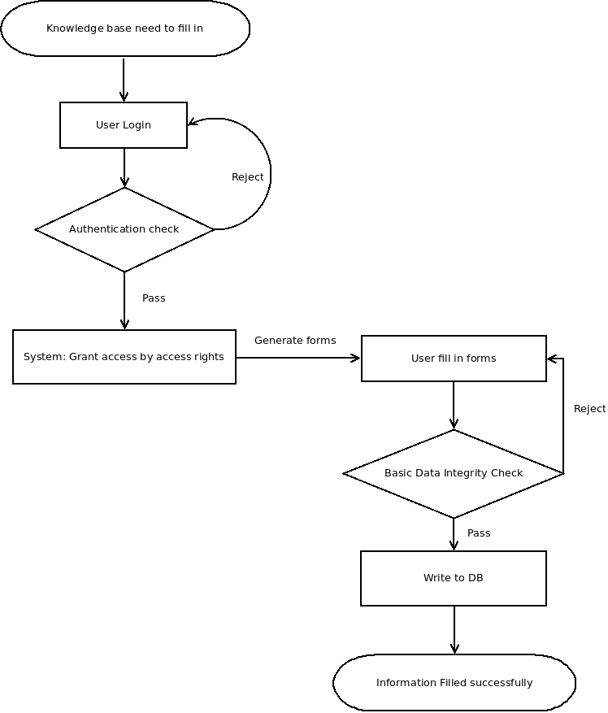
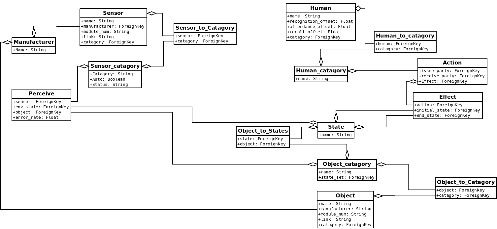

[&#xf0eb;] **Design Control Documentation**
-------------

&#xf040; By Aaron Li, May 16, 2016. 

### [&#xf192;] **Targets and Requirements**

Design Control is the **interface** that responsible for **set up the knowledge base**. Targeted for two kinds of users:  medical personnel and administration engineers. 

* Care Givers
	* Care givers are personnel who works in a hospital, private home, or other settings that are responsible for helping patiences in everyday life.
	* Care givers are presumed to have no knowledge of the system, or components of the system. Which requires the system to fits the following requirements as much as possible:
		* No knowledge: no knowledge of the system is required.
		* Easily Adapted: first time user should be able to use right away without instructions.
		* Time Constricted: should be able to set up with the shortest time possible. 
* Administration Experts
	* People presume to have partial knowledge of the system, have at least one of the followings:
		* Industry knowledge: necessary knowledge of the sensor communication protocol, error rates. 
		* Field experience: knowledge of how to set up a working module with correct trigger, environment, target, reward, and probability.
		* Medical knowledge: knowledge of patience behaviour.

### [&#xf11e;] **User Workflow**

For each role in the system, the users should be able to login as the role, and modify knowledge base limited only to the portions that they have access to. 

> **Access Decision** [&#xf084;]:
> 
> Security and correctness of the system relies on the knowledge base, which is built by content providers, in this case the care givers and Administration experts. The system should be able to give enough freedom for each parties to set up knowledge base, and not a little bit more, for the following reasons:
> * **Separate of Logic**:  each role can only access the part that they should access, in order to provide correct information to the knowledge base.
> * **Minimal Access**: each role accesses the information as little as possible, gives protection on information correctness and integrity.
> * **Bugs Tracking**: each role have their own responsibility in the system, this makes bug correction faster and easily. Increase reliability of the system as a whole.
> * **Collaboration Conflicts**: collaboration is critical in order to build the knowledge base. Each rule should only be able to modify the parts they should modify, in order to have no conflicts during collaboration.

The workflow of one user can be expressed by the diagram: 

  

### [&#xf1c0;] **Database Outline**

In a high level view, human act on environment objects, trigger change of status in sensors. Which indicates the system contain three major factors:

* Human
* Sensors
* Environment Objects

And a high level DB is as following:

For more details, look [here](db_structure.md).

### [&#xf0c0;] **Roles**

Rules are the safe guards against modify the model without the knowledge of the part, as well as separation of the responsibilities.  
The roles including the following:

* Super User
* HR Specialist
* Testing Engineer
* Safety Inspector
* Hardware Engineer
* Interior Designer
* Medical Care Experts
* Caregivers

See the details [here](./roles.md).

### [&#xf1cb;] **Software Framework - Admin Expert System**

In general, the software framework should be able to allow for one expert to do the following tasks, along with non-functional requirements:

* Role Based Management
* Information Management
* Testing

For Details, check on [here](admin_software_overview.md).