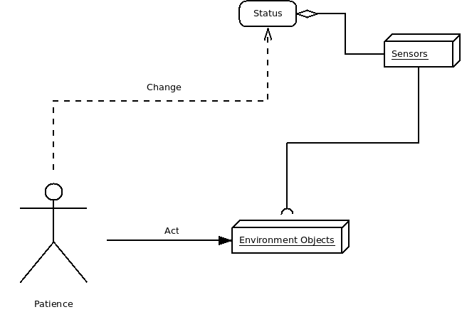
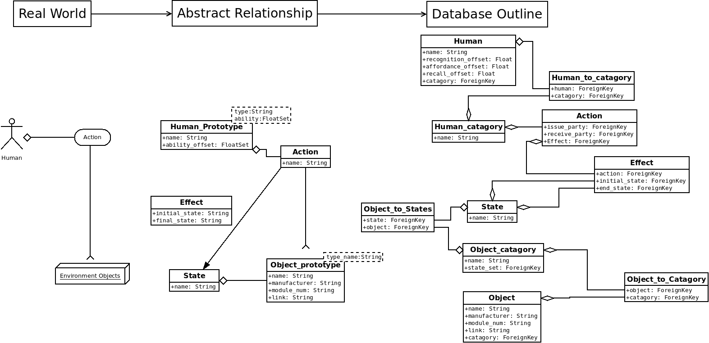
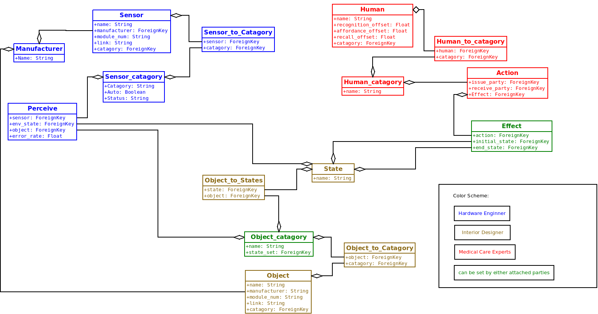

[&#xf0eb;] **Design Control Documentation**
-------------

&#xf040; By Aaron Li, May 16, 2016. 

### [&#xf192;] **Targets and Requirements**

Design Control is the **interface** that responsible for **set up the knowledge base**. Targeted for two kinds of users:  medical personnel and administration engineers. 

* Care Givers
	* Care givers are personnel who works in a hospital, private home, or other settings that are responsible for helping patiences in everyday life.
	* Care givers are presumed to have no knowledge of the system, or components of the system. Which requires the system to fits the following requirements as much as possible:
		* No knowledge: no knowledge of the system is required.
		* Easily Adapted: first time user should be able to use right away without instructions.
		* Time Constricted: should be able to set up with the shortest time possible. 
* Administration Experts
	* People presume to have partial knowledge of the system, have at least one of the followings:
		* Industry knowledge: necessary knowledge of the sensor communication protocol, error rates. 
		* Field experience: knowledge of how to set up a working module with correct trigger, environment, target, reward, and probability.
		* Medical knowledge: knowledge of patience behaviour.

### [&#xf11e;] **User Workflow**

For each role in the system, the users should be able to login as the role, and modify knowledge base limited only to the portions that they have access to. 

> **Access Decision** [&#xf084;]:
> 
> Security and correctness of the system relies on the knowledge base, which is built by content providers, in this case the care givers and Administration experts. The system should be able to give enough freedom for each parties to set up knowledge base, and not a little bit more, for the following reasons:
> * **Separate of Logic**:  each role can only access the part that they should access, in order to provide correct information to the knowledge base.
> * **Minimal Access**: each role accesses the information as little as possible, gives protection on information correctness and integrity.
> * **Bugs Tracking**: each role have their own responsibility in the system, this makes bug correction faster and easily. Increase reliability of the system as a whole.
> * **Collaboration Conflicts**: collaboration is critical in order to build the knowledge base. Each rule should only be able to modify the parts they should modify, in order to have no conflicts during collaboration.

The workflow of one user can be expressed by the diagram: 

  

### [&#xf1c0;] **Database Outline**

In order to support the knowledge base, the database have to support tracking and reasoning module, we have to first understand the relationship between human, sensors, and environment objects. 

#### A High Level View

In a high level view, human act on environment objects, trigger change of status in sensors. Which can be indicate as following: 

  

But unfortunately, this is not merely enough to represent by db, there are several questions remain: 

* What category of sensor and environment objects can work together?
* What status can one particular sensor have?
* What kind of action can a human perform?
* What kind of action can trigger one kind of sensor stage change?

In order to answer those questions, we have to investigate further to build relationship. 

#### Environment Objects & Sensors

Sensors attached to environment objects, a change in environment objects reflect in change of sensors. Only one set of sensors can attach to one kind of environment objects, so we group both sensors and environment objects into groups.

#### Human & Environment Objects

Human interact with environment objects. Only one set of environment object is allow to interact by human, and the actions are limited. Human object is divided into categories as well to represent different level of patience, to divide the ability of patience.

#### Human , Sensors and Environment Objects

### [&#xf0c0;] **Roles**

Rules are the safe guards against modify the model without the knowledge of the part, as well as separation of the responsibilities. Each roles have the following properties:

* Required knowledge: knowledge required for the person to take the role. 
* Responsibilities: the responsibilities of the role.
* Access rights: which portion of the system can the role modify.

### Maintenance User Class
Maintenance class users are the backbone of the system. They are responsible to supervise, approve, and maintain the system running.

#### Super User
Super user is the core admin of the system. This role should lead by developers with high knowledge of the system. This roles are limited to have a maximum of three instances.

* Required knowledge:
	* computer science
	* administration skills
	* working knowledge of the system
* Responsibilities: 
	* system health monitoring
	* debugging and damage control
* Access rights: all rights granted

#### HR Specialist
HR specialist is a role that allow to add user into the system.

 * Required knowledge: 
	 * HR
	 * Structure of this role system
 * Responsibilities:
	 * appointing roles
 * Access rights
	 * appoint any roles except super user

#### Testing Engineer
Testing Engineers are the Engineers that testing the system and report to relative experts if there is information correctness problem.

* Required knowledge: 
	* Working knowledge of the system
	* DB structure
	* Software and hardware testing skills
* Responsibilities:
	* checking correctness of system
* Access rights
	* testing modules

#### Safety Inspector
Safety Inspectors are possibly the most important role in the system. Their role is to check all possible safety requirements fits before grants one knowledge base to be used in the field, and take responsibility of their inspections. It is **enforced to require safety inspector's signature(s)** before used in field, since safety always comes first, under any circumstances it is better to not run the system than run a partially guarded system.

> **Enforced Security Rules** [&#xf132;] 
> 
> Why we take security so carefully? 
> A under-developed smart home have the possibility to **kill humans**, and should **NEVER** be taking easily.  It is never a good idea to run a system without detailed security inspections. (The [TV show "Almost Human" season 1 episode 11](http://www.imdb.com/title/tt3482248/?ref_=ttep_ep11) elaborates a possibility of smart home kills people), any security hazard should be prevent in the design phase.

The role is recommended to assign to multiple people, according to the required knowledge. To prevent the following and not limited to the following disasters happened: 

* Internal safety disaster: 
	* any disaster triggered by the system itself. For example, sensor voltage set up incorrectly to cause fire.
* External safety disaster:
	* any disaster triggered by people during using the system. For example, patients stop response when light up stove.
* Communication level breach:
	* any breach triggered by communication level, include software and hardware communication.

So in order to prevents those disasters, the infrastructure is the following:

* Required knowledge: 
	* Safety management
	* Hardware knowledge
	* Software security
* Responsibilities
	* Make sure the system any of the disasters described above can not happened under any situations
* Access right:
	* All right granted, and access to source code under disclosure

### Administration User Class
Administration class users are responsible to fill in pre-defined knowledge in knowledge base in order to allow care givers to set up the system easily and quickly. 

#### Hardware Engineer

* Required knowledge: 
	* working knowledge of sensors in hardware level
* Responsibilities:
	* set up sensor relative knowledge 
* Access rights:
	* name
	* factory
	* effects (all available states)
	* target prototype (furniture object prototype)
	* HTTP/HTTPs commands for effect (changing of states)
	* sensor error rate

#### Interior Designer

Designers work with factories that design indoor utilities, include:

* Smart furnitures: 
	* furnitures have the ability to attach sensors, or sensor embedded
* Environment utilities 
	* for example: door, water valet

Infrastructure as following:

* Required knowledge: 
	* design knowledge
	* partially sensor knowledge (how to use sensors correctly)
* Responsibilities
	* fill in the environment object prototype
* Access rights:
	* environment object prototype

#### Medical Care Experts
Medical care experts are experts that study and know the patience behaviours, normally researchers in relative medial field. For example: doctor study Alzheimer patience.

> **Caution Hot!** [&#xf0f4;]
>  
> Do not get confused this role with care givers
> Medical care experts are not care givers. Although sometime the care givers might have the necessary knowledge, it is **not recommended to let care givers take this role**. Let care givers take this role not only violate the principle in system requirements, but also increase the chance of false information in knowledge base, since care givers can not be trusted with fill in the knowledge base. 

* Required knowledge: 
	* medical knowledge
* Responsibilities
	* fill in the 
* Access rights:
	* environment object prototype

### [&#xf1b3;] **Collaboration Workflow**

The following graph marks the access right of all three parties.

