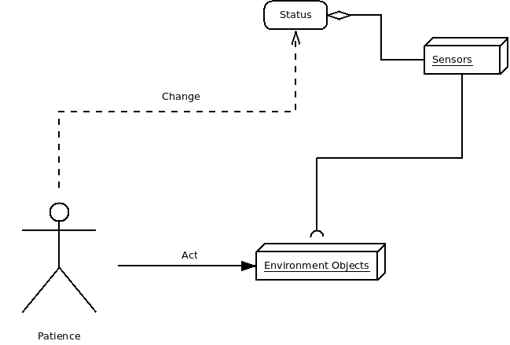
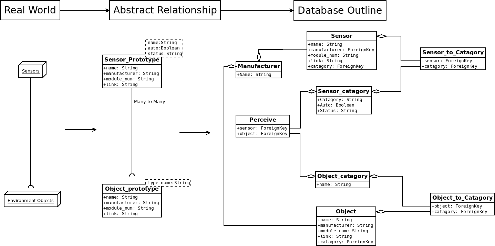
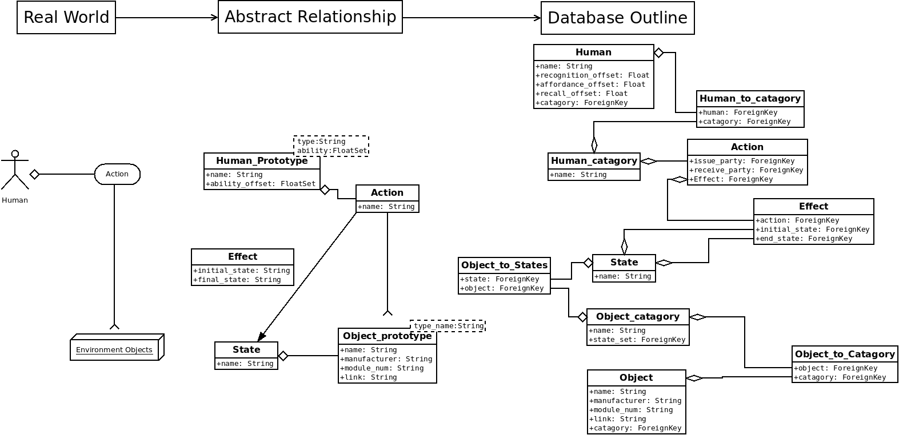

[&#xf1c0;] **Database Outline**
-------------

### [&#xf192;] **Targets**

In order to support the knowledge base, the database have to support tracking and reasoning module, we have to first understand the relationship between human, sensors, and environment objects. 

### [&#xf0ac;] **A High Level View**

In a high level view, human act on environment objects, trigger change of status in sensors. Which can be indicate as following: 

  

But unfortunately, this is not merely enough to represent by db, there are several questions remain: 

* What category of sensor and environment objects can work together?
* What status can one particular sensor have?
* What kind of action can a human perform?
* What kind of action can trigger one kind of sensor stage change?

In order to answer those questions, we have to investigate further to build relationship. 

### Environment Objects & Sensors

Sensors attached to environment objects, a change in environment objects reflect in change of sensors. Only one set of sensors can attach to one kind of environment objects, so we group both sensors and environment objects into groups.

### Human & Environment Objects

Human interact with environment objects. Only one set of environment object is allow to interact by human, and the actions are limited. Human object is divided into categories as well to represent different level of patience, to divide the ability of patience.

### Human , Sensors and Environment Objects

