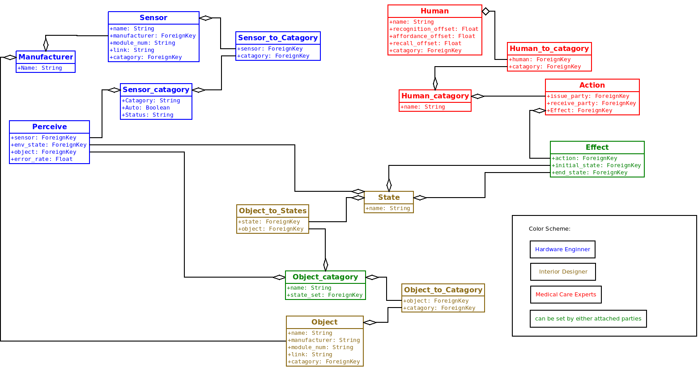

[&#xf0c0;] **Roles in Design Control**
-------------
&#xf040; By Aaron Li, May 16, 2016. 

### [&#xf192;] **Targets and Requirements**

Rules are the safe guards against modify the model without the knowledge of the part, as well as separation of the responsibilities. Each roles have the following properties:

* Required knowledge: knowledge required for the person to take the role. 
* Responsibilities: the responsibilities of the role.
* Access rights: which portion of the system can the role modify.

### [&#xf0ad;] **Maintenance User Class**
Maintenance class users are the backbone of the system. They are responsible to supervise, approve, and maintain the system running.

#### Super User
Super user is the core admin of the system. This role should lead by developers with high knowledge of the system. This roles are limited to have a maximum of three instances.

* Required knowledge:
	* computer science
	* administration skills
	* working knowledge of the system
* Responsibilities: 
	* system health monitoring
	* debugging and damage control
* Access rights: all rights granted

#### HR Specialist
HR specialist is a role that allow to add user into the system.

 * Required knowledge: 
	 * HR
	 * Structure of this role system
 * Responsibilities:
	 * appointing roles
 * Access rights
	 * appoint any roles except super user

#### Testing Engineer
Testing Engineers are the Engineers that testing the system and report to relative experts if there is information correctness problem.

* Required knowledge: 
	* Working knowledge of the system
	* DB structure
	* Software and hardware testing skills
* Responsibilities:
	* checking correctness of system
* Access rights
	* testing modules

#### Safety Inspector
Safety Inspectors are possibly the most important role in the system. Their role is to check all possible safety requirements fits before grants one knowledge base to be used in the field, and take responsibility of their inspections. It is **enforced to require safety inspector's signature(s)** before used in field, since safety always comes first, under any circumstances it is better to not run the system than run a partially guarded system.

> **Enforced Security Rules** [&#xf132;] 
> 
> Why we take security so carefully? 
> A under-developed smart home have the possibility to **kill humans**, and should **NEVER** be taking easily.  It is never a good idea to run a system without detailed security inspections. (The [TV show "Almost Human" season 1 episode 11](http://www.imdb.com/title/tt3482248/?ref_=ttep_ep11) elaborates a possibility of smart home kills people), any security hazard should be prevent in the design phase.

The role is recommended to assign to multiple people, according to the required knowledge. To prevent the following and not limited to the following disasters happened: 

* Internal safety disaster: 
	* any disaster triggered by the system itself. For example, sensor voltage set up incorrectly to cause fire.
* External safety disaster:
	* any disaster triggered by people during using the system. For example, patients stop response when light up stove.
* Communication level breach:
	* any breach triggered by communication level, include software and hardware communication.

So in order to prevents those disasters, the infrastructure is the following:

* Required knowledge: 
	* Safety management
	* Hardware knowledge
	* Software security
* Responsibilities
	* Make sure the system any of the disasters described above can not happened under any situations
* Access right:
	* All right granted, and access to source code under disclosure

### [&#xf17c;] Administration User Class
Administration class users are responsible to fill in pre-defined knowledge in knowledge base in order to allow care givers to set up the system easily and quickly. 

#### Hardware Engineer

* Required knowledge: 
	* working knowledge of sensors in hardware level
* Responsibilities:
	* set up sensor relative knowledge 
* Access rights:
	* name
	* factory
	* effects (all available states)
	* target prototype (furniture object prototype)
	* HTTP/HTTPs commands for effect (changing of states)
	* sensor error rate

#### Interior Designer

Designers work with factories that design indoor utilities, include:

* Smart furnitures: 
	* furnitures have the ability to attach sensors, or sensor embedded
* Environment utilities 
	* for example: door, water valet

Infrastructure as following:

* Required knowledge: 
	* design knowledge
	* partially sensor knowledge (how to use sensors correctly)
* Responsibilities
	* fill in the environment object prototype
* Access rights:
	* environment object prototype

#### Medical Care Experts
Medical care experts are experts that study and know the patience behaviours, normally researchers in relative medial field. For example: doctor study Alzheimer patience.

> **Caution Hot!** [&#xf0f4;]
>  
> Do not get confused this role with care givers
> Medical care experts are not care givers. Although sometime the care givers might have the necessary knowledge, it is **not recommended to let care givers take this role**. Let care givers take this role not only violate the principle in system requirements, but also increase the chance of false information in knowledge base, since care givers can not be trusted with fill in the knowledge base. 

* Required knowledge: 
	* medical knowledge
* Responsibilities
	* fill in the 
* Access rights:
	* environment object prototype

### [&#xf1b3;] **Collaboration Workflow**

The following graph marks the access right of all three parties.

