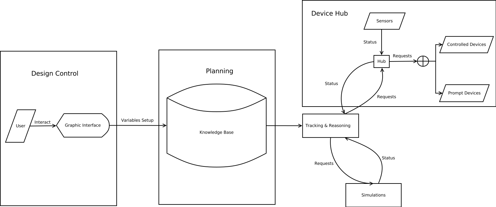

[&#xf0eb;] **Syndetic Assistance Processes (SNAP) 2.0 Project Proposal**
-------------
&#xf040; By Aaron Li, May 4, 2016. May the force.

### [&#xf192;] **Targets**
The Syndetic Assistance Processes(SNAP) 2.0 is expected to upgrade and integrate old SNAP systems, based on two previous SNAP projects:

* SNAP Planner
	* [Intro](https://cs.uwaterloo.ca/~jhoey/research/snap/index.php)
	* [Server](http://scspc300.cs.uwaterloo.ca/snap/snap-iu-web/public_html/)
* [Vera CHIL](https://github.com/newpro/vera_chil)

Skip the introduction here. Intros are in the links.

The overall target is having a **easy** to use **graphic interface** to let engineers, developers, or common users **set up the system** with **no implementation or even understanding knowledge** of activity recognition intelligent environments. 

New SNAP interface is expect to have unified interface links to physical sensors. Targeted to allow users to do the followings:

* Logic set-ups
	* Setup logic of the System with parameters
	* Visualize Control Flow
	* Change the status, probability, and transactions

* Devices control & feedbacks
	* Add devices
	* Feed forward and backward testing: 
		* trigger individual devices to follow a command for device testing
	* Trigger group of devices to follow a sets of commands for testing:
		* Processing logic: a set of commands to test one logic set, testing results equal to expect results

### [&#xf066;] **Minimum functionailities**
The minimum functionalities of this module should include the followings:

#### Display
* Diagram
* Response from devices
	* Online status
	* Response status

#### Edit
* Status by uml boxes
* Probability by labels on uml boxes
* Transactions by arrows

#### Devices Setups
In order to control the devices, the system use HTTP/HTTPs to:

* Detect the devices
* Link the commands to the actual http requests
	* automatically link commands to requests for pervious recogonized devices sets
	* free to modify the links and the commands
* Trouble shooting devices

>  Design decision: HTTP requests  [&#xf05a;]
>  
>  Why we are using http/https requests to communicate with devices instead of other methods or communication protocols?
>  
>  The main reason of the choice is http(s) protocol can be recognized and transferred regardless of the platforms and resources available, this allows to transfer our logic easily between different platforms with little or no change of the backend. For example, if we want to change the control from web to mobile, since mobile platform also use http requests as communication formats, it only need modification in the front end. 

#### Simulation
It should be able to provide testing environment disregard of the lack of hardware environment. The simulation environments should represent physical objects (non-human objects), sensor objects, and human objects in real world, and have exactly same behaviours as real worlds objects.

* Specify physical object in the environment, and all the status it can have
* Specify initial status of all physical objects
* Specify sensor objects, their error rate, and which variable they can detect
* Specify human objects that have abilities and issue interaction with objects in the environments 
* Allow humans objects in the environments to interact with physical objects 

>  Debate: Simulation  [&#xf1d0; - &#xf1d1;]
> 
> Is the existence of simulation really necessary?
> 
> Since the system is intended to build for work along with all sensor environments, is it make more sense to test and work with the actual sensor system instead of create virtual environment that simulate the actual sensor system?
> 
> There is no right or wrong about this. The disadvantage of use virtual environment for testing is it does not allow hardware problems and the errors happened to surface, which should clearly be part of SNAP responsibilities to detect those errors. For those reasons there might be error happens in the system design and planning phase, result in the designed knowledge base is useless or completely useless for the actual hardware system. Also this result in a longer testing cycle (test in both virtual environment and real world environment). The advantage is it isolates the hardware system, so engineers and computer scientists can focus on construct knowledge base without much of hardware considerations and set ups. It is a trade off between correctness and decoupling in testing systems.

#### Errors Capture
The platform should be able to capture all the errors correctly on and between every stages and modules, and display all correctly. 

* Raw errors return from device
* Errors of impossible control flows
* Errors of failure of interface during executions

###  [&#xf19c;] **Standards** 

#### Graph Interface
The graph is represented in UML, expected to follow [UML Standards 2.5](http://www.omg.org/spec/UML/2.5/)

>  Design decision: UML  [&#xf05a;]
> 
>  UML allows ppl to communicate better, giving the following advantages in this project:
> * Language and API independent: allow UI too isolated with backend logic modules
> * Universal and easy: UML is easy to understand by both developer and none developer, fit for both situations, good for convey unambiguous work flows
> * Built for OO: since we are focus on mapping situations and devices to real world, a OO approach is the way to go
> * Standardized
		
### [&#xf085;] **Frameworks**
#### Control Flow Construction: [symbolicPerseusJava](https://cs.uwaterloo.ca/~jhoey/research/spudd/symbolicPerseusJava.tar.gz)

* Java program to construct a control flow based on following variables:

#### *Environment Status*
* **Environment variables (E):** depend on nothing 
	* Variables sets to represent the environment state, with possibilities, and **at least one** of the environment variables set have to represent the target. Each variable track **one** of the followings:
		* status of the components in real world
		* status of the position of a component
		* status of the relationship between components
	* One variables set include:
		* name
		* value
		* initial probability
	* Examples:
		* bin lid open/close with 0.01, 0.99
		* tea bag in/not in the bin with 0, 1

#### *Human Status*
* **Behavior variables (B):** depend on E
	* track the behaviour of human
		* each variable set represent one behaviour and timeout to fit **all** of the followings:
			* change the state of one or more environment variables
			* engage with a physical object in real world, include one of state/position/relationship
		* always two behaviours present, other and nothing
	* one variables set include: 
		* name
		* timeout
* **Ability variables (A):** depend on B
	* ability the person need to complete an behavior. Each ability **must** belong to **one of** the following types: 
		* recognition
		* affordance
		* recall
	* one variables set include:
		* name
		* type
		* gain probability: probability if not process, and gain during process without prompt (ideally 0.5)
		* lose probability: prob of loss the ability (ideally 0.4)
		* gain by prompt probability (ideally 0.95)
		* loss by prompt probability (ideally 0.05)
		* initial probability: prob for knowledge of this person process this ability (do not know is 0.5)
		* ability prompt cost: reward system calculation (ideally 1)

#### *Sensor Status*
* **Observation variables (O):** depend on nothing
	* similar to tracking variables (environment or behaviors variables), except it is observation
	* a observation can be one of the following:
		* a observation against one human behavior (open doors)
		* a observation against one environment variable
	* one variables set include:
		* name
		* value
* **Environment Sensor model (ESM)**: depend on E and O
	* (sometime called Sensor model)
	* the link between one observation and one Environment variable
	* between two variables have to specify all four permutations, so for user side it need to specify two for one set of variables. Example about one environment variable E1 and one observation variable O1, it have to specify two relationships:
		* E1 on, O1 on, 0.95 (which gives E1 on, O1 off 0.05)
		* E1 off, O1 off, 0.99 (which give E1 off, O1 on 0.01)
	* one variables set include:
		* observation name
		* observation value
		* variable name
		* variable value
		* probability
* **Behaviour of Sensor model (BSM)**: depend on B and O
	* similar as SM, except target on one behaviour variable
	* one variables set include:
		* observation name
		* observation value
		* behaviour name
		* probability
	
#### *Effect Status*
* **Effect of Behaviours (EB)**: depend on B and E
	* link between behaviour and Environment, what the behaviour doing to the world
	* one variables set include: 
		* id
		* behaviour name
		* environment variable name
		* environment variable value
* **Precondition of effects (PEB)**: depend on EB
	* precondition in order to let the effect to have effect
	* one variables set include:
		* effect id
		* environment variable name
		* environment variable value

#### *Target Status*
* **Goals:** one or more environment variable and value
* **Initial state (task state):** one or more environment variable and value
* **Abilities:** abilities needed to perform the task
* **Behaviour:** one or more behaviours needed to reach the goal
* **probability:** 1

#### *Reward Status*
* **Reward:** 
	* one variable set include
		* id
		* value
		* name
		* environment variable name
		* environment variable value

#### Device Control: Luup Library
We used to use Vera as a platform to connect to devices. This should no longer be the only case, since the platform should be able to connect to any devices within the network. But still, for testing http requests propose, so we are continuing using Luup libary build by Mi Casa Verde (Vera) as our main focus. 

[Here](http://wiki.micasaverde.com/index.php/Main_Page) is the details of the Vera set ups. 

And [here](http://wiki.micasaverde.com/index.php/Luup_Requests) is the requests commands natively recognized by Vera. 

For a general usages toward one kind of reconized and non-recognized devices support by Vera, find it [here](http://wiki.micasaverde.com/index.php/Luup_Devices), and arguments table can be find [here](http://wiki.micasaverde.com/index.php/Luup_UPnP_Variables_and_Actions).

Although the overall Vera documentations are chaos and not well organized, all the informations you wants to find about Vera is indexed [here](http://wiki.micasaverde.com/index.php/Special:AllPages). 

### [&#xf073;] **Proposal**

There are several **challenges** for this projects:

#### Integration Challenges

There is challenges of integrate with the existing parts in order to work properly, the challenges include:

* Different languages in control flow construction: in order to process requests, server need to run in the same language. The control flow construction program is written in Java, which post a problem. 
	* **Solution 1**: running JVM in the same python server. 
		*  framework like [py4J](https://www.py4j.org/) allows run JVM in a python server
		* easy and direct solution, but not clean. The server will be slow, the robustness depend on server robustness on high workload, and robustness of bridge framework, which decrease overall robustness, have a higher risk of break
	* **Solution 2**: run Java in one server and Python in another
		* run two server and connect with sockets
		* have the risk of connection delay, and point of failure
	* **Solution 3**: tire down Java logic and rebuild in python
		* rebuild the logic might be a good solution, it provide relative robust running environment and better communication between modules, but rebuild will cost time.
* Communication between modules
	* Sequence coordination: 
		* since each modules are following a workflow, and often time it takes a long time for one module to process request, so one have to wait for others to finish in order to begin workload. It is important to pass on states of the execution and coordinate with each other.
	* Message and error passing: 
		* modules need to have a universal language to pass result, and pick up the error and pass on in order to display in the final phases.
	* **Solution:** both of the problem can be solved by sync signal and message payload format. The communication message should contain two parts: 
		* signal code (error, success, warning)
		* message payload

### [&#xf0e8;] **Implementation Structure**

The structure of the implementation is separated by functionalities in to four main modules: design control, planning, device control, and plan execution. 

* Design Control
	* Design control is the controller of the operation. It responsibility is take inputs that represent the environments, the assocated rewards and goals in order to builid the system.
* Planning
	* Planning is the brain of the operation, its responsibility is construct the decision tree based on information inputs from design control.
* Device Hub
	* Device Hub is the communication hub between the reasoning system and the sensors, so its responsibility include in setup map between commands and http requests.
* Tracking and Reasoning
	* Reasoning is the command central for all real time interaction. It collect the status of devices, compute what to do, and issue next command to devices. Plan execution is intended to test with a real or virtual worlds to see if the logic is implementable correctly. Its responsibility include display testing feedbacks and trigger situations.
* Simulation
	* Simulation is intended to replace device hub and human interaction with device hub, it should simulate all physical objects, human objects, and sensor objects, get command from reasoning and response accordingly. 

